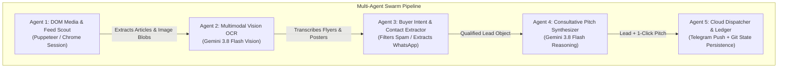

# 🧠 Multi-Agent Architecture & Training Manual
## Autonomous Facebook Lead & Multimodal OCR Radar (Growech Solution)

This document formalizes the multi-agent system architecture running inside `growech-solution/scripts/facebook-radar/`.

---

---

### 1. Agent 1: DOM Media & Feed Scout
* **Role**: Browser-level extraction of high-traffic group feeds.
* **Capabilities**:
  * Loads authenticated Chrome user sessions (`Muhammad Mustafa`) with anti-detection headers.
  * Navigates chronological feeds (`/?sorting_setting=CHRONOLOGICAL`).
  * Isolates post articles (`[role="article"]`) and distinguishes user-uploaded flyer images from small UI emojis/avatars (`naturalWidth > 140px`).
  * Converts image elements into clean base64 data payloads in-browser without CORS restrictions.

---

### 2. Agent 2: Multimodal Vision OCR Engine
* **Role**: Visual transcription of Canva graphics, hiring flyers, error screenshots, and WhatsApp chats.
* **Powered by**: **Google Gemini 3.8 Flash Multimodal Vision** (with fallback to `gemini-3.5-flash-lite`).
* **Processing**:
  * Ingests raw image base64 + optional post caption.
  * Performs 100% text transcription across English, Urdu, phone numbers, email addresses, and technical requirements.

---

### 3. Agent 3: Buyer Intent & Contact Extractor
* **Role**: The Gatekeeper that separates real paying clients from freelancer spam.
* **Heuristics & Prompts**:
  * Identifies buyer signals: hiring developers, looking for custom Shopify themes, fixing payment gateway checkout bugs, WordPress development, Next.js web applications.
  * Filters out sellers: freelancers advertising their own portfolios or generic service flyers.
  * Parses regex and visual contact patterns to pull direct phone numbers and WhatsApp links printed on flyers.

---

### 4. Agent 4: Consultative Pitch Synthesizer
* **Role**: Generates conversion-focused, low-friction initial outreach messages.
* **Rules**:
  * Strictly under 60 words.
  * Consultative tone (no "Hello sir check inbox").
  * Directly cites the specific problem observed on the flyer (e.g. *"Saw your requirement for custom Liquid theme fixing and checkout gateway error..."*).
  * Offers an instant 1-minute interactive demo or portfolio walkthrough.

---

### 5. Agent 5: Cloud Dispatcher & State Ledger
* **Role**: 24/7 delivery and deduplication.
* **Infrastructure**:
  * Runs on GitHub Actions Ubuntu cloud runners (zero ISP blocks).
  * Dispatches rich HTML alerts to Mustafa's Telegram bot (`@...`).
  * Appends lead records to `captured_leads.json`.
  * Commits hash ledger to `seen_facebook_posts.json` with `[skip ci]` to ensure zero duplicate notifications.

---

### 🚀 Execution Methods
1. **Cloud Autopilot**: Runs every 10 minutes via `.github/workflows/growech-facebook-radar.yml`.
2. **Local 1-Click**: Launch `run-facebook-radar.bat` directly on Windows anytime.
